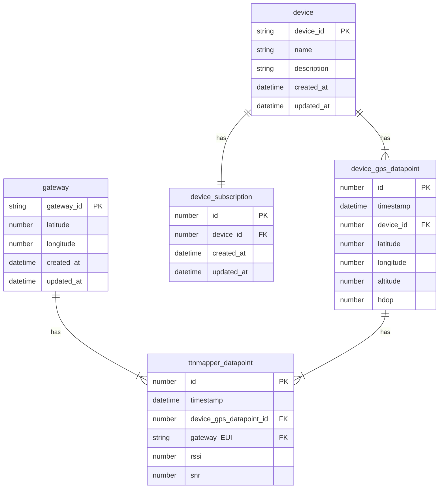

```mermaid
erDiagram
    device ||--|{ device_gps_datapoint : has
    device ||--|| device_subscription : has
    gateway ||--|{ ttnmapper_datapoint : has
    device_gps_datapoint ||--|{ ttnmapper_datapoint : has

    device {
        string device_id PK
        string name
        string description
        datetime created_at
        datetime updated_at
    }

    gateway {
        string gateway_id PK
        number latitude
        number longitude
        datetime created_at
        datetime updated_at
    }

    device_gps_datapoint {
        number id PK
        datetime timestamp
        number device_id FK
        number latitude
        number longitude
        number altitude
        number hdop
    }

    ttnmapper_datapoint {
        number id PK
        datetime timestamp
        number device_gps_datapoint_id FK
        string gateway_EUI FK
        number rssi
        number snr
    }

    device_subscription {
        number id PK
        number device_id FK
        datetime created_at
        datetime updated_at
    }
```