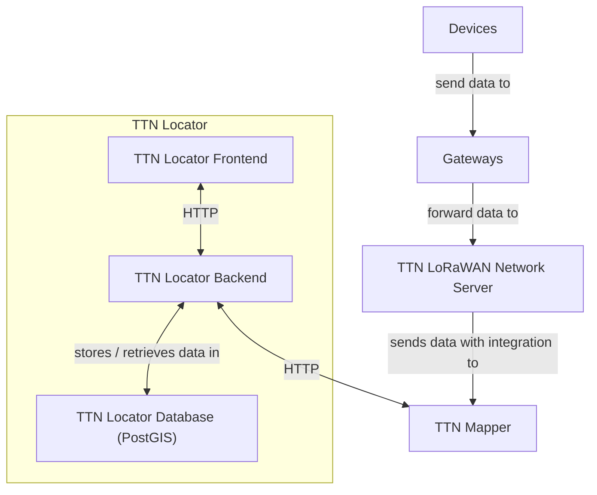

<!-- https://mermaid.live -->
<!-- Use "garden" theme -->

```mermaid
flowchart TD
    subgraph TTNL [TTN Locator]
    TTNLF[TTN Locator Frontend]<-->|HTTP|TTNLB[TTN Locator Backend]
    TTNLB<-->|stores / retrieves data in|TTNLDB["TTN Locator Database (PostGIS)"]
    end
    TTNLB<-->|HTTP|TTNM
    DVs[Devices]-->|send data to|GWs
    GWs[Gateways]-->|forward data to|TTN-LNS
    TTN-LNS[TTN LoRaWAN Network Server]-->|sends data with integration to|TTNM[TTN Mapper]
```